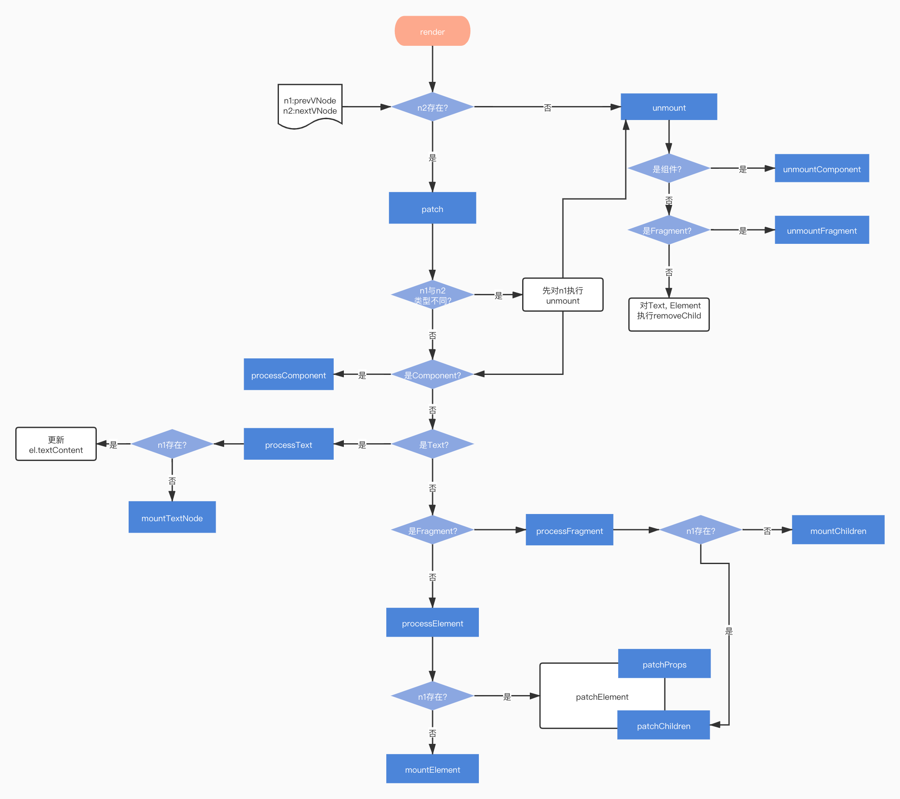

# patch

patch 是什么？
Reconciliation
diff 算法

## patch 流程图



## 改造 render 函数

改造 render 函数，使之能存储 prevVNode

## patchChildren


vue 源码的 patchChildren 结构

```javascript
if (shapeFlag & ShapeFlags.TEXT_CHILDREN) {
  if (prevShapeFlag & ShapeFlags.ARRAY_CHILDREN) {
    unmountChildren(c1);
  }
  if (c2 !== c1) {
    container.textContent = c2;
  }
} else {
  // c2 is array or null

  if (prevShapeFlag & ShapeFlags.ARRAY_CHILDREN) {
    // c1 was array

    if (shapeFlag & ShapeFlags.ARRAY_CHILDREN) {
      // c2 is array
      // patchArrayChildren()
    } else {
      // c2 is null
      unmountChildren(c1);
    }
  } else {
    // c1 was text or null

    if (prevShapeFlag & ShapeFlags.TEXT_CHILDREN) {
      container.textContent = '';
    }
    if (shapeFlag & ShapeFlags.ARRAY_CHILDREN) {
      mountChildren(c2, container, anchor);
    }
  }
}
```

## patchUnkeyedChildren

```javascript
const n1 = h('ul', null, [
  h('li', null, 'a'),
  h('li', null, 'b'),
  h('li', null, 'c'),
]);

const n2 = h('ul', null, [
  h('li', null, 'd'),
  h('li', null, 'e'),
  h('li', null, 'f'),
]);
```

> c1: a b c
> c2: d e f

> c1: a b c
> c2: d e f g h

> c1: a b c g h
> c2: d e f

## Fragment 的问题

```javascript
render(
  h('ul', null, [
    h('li', null, 'first'),
    h(Fragment, null, []),
    h('li', null, 'last'),
  ]),
  document.body
);

render(
  h('ul', null, [
    h('li', null, 'first'),
    h(Fragment, null, [h('li', null, 'middle')]),
    h('li', null, 'last'),
  ]),
  document.body
);
```
